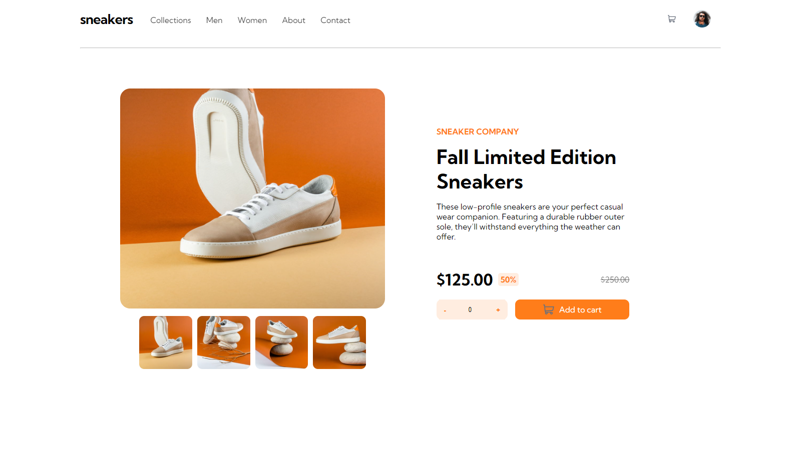
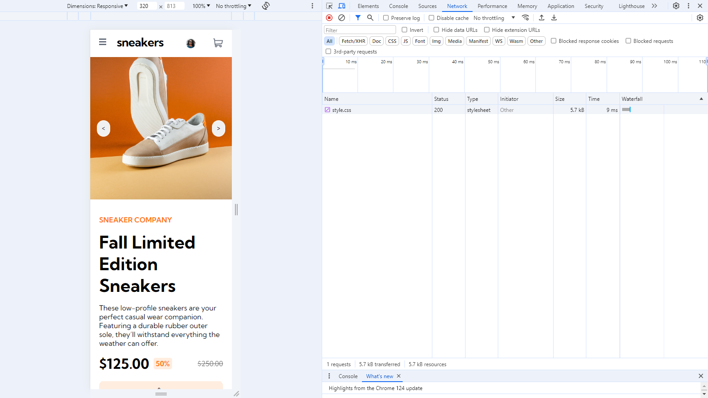

# Frontend Mentor - E-commerce product page solution

This is a solution to the [E-commerce product page challenge on Frontend Mentor](https://www.frontendmentor.io/challenges/ecommerce-product-page-UPsZ9MJp6). Frontend Mentor challenges help you improve your coding skills by building realistic projects.

## Overview

### The challenge

Users should be able to:

- View the optimal layout for the site depending on their device's screen size
- See hover states for all interactive elements on the page

- Switch the large product image by clicking on the small thumbnail images

### Screenshot
#### Desktop view

#### Mobile view

### Links

- [Live Site URL](https://erfan-karimii.github.io/detail-view-html-css/)

## My process

### Built with

- Semantic HTML5 markup
- CSS custom properties
- Flexbox
- Mobile-first workflow
For styles

### What I learned

using oure html5 and css3 to code a responsive detail view product web page

To see how you can add code snippets, see below:

### Useful resources

- [the starting point tutorial](https://youtu.be/zJSY8tbf_ys?si=qxfyxIJurg2pP4lk)
- [basic html css knowledge](https://www.w3schools.com/) 

